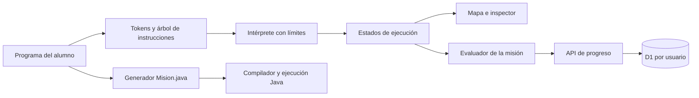

# Robótica Java · Lógica y POO

Laboratorio educativo en español con **90 misiones**, construido a partir de la primera versión Huerto Java. Se aprende a leer, predecir, ordenar, depurar y escribir código, con un mapa de robots y un inspector de variables, objetos, referencias y llamadas.

- **Repositorio privado:** [Jexxe0012/robotica-java](https://github.com/Jexxe0012/robotica-java).
- **Despliegue privado:** [Abrir Robótica Java](https://huerto-java-josue.sandobaljosue16.chatgpt.site).
- **Comprobaciones automáticas:** [GitHub Actions](https://github.com/Jexxe0012/robotica-java/actions).

El proyecto enseña Java, mientras que la aplicación web y el intérprete están implementados en JavaScript. Los ejercicios descargables se ejecutan con un JDK real. No requiere Minecraft ni un servidor de Minecraft.

## Vista de aventura en revisión

La rama `codex/aventura-pixel-art` propone una interfaz de aventura 2D: un camino de diez misiones por capítulo, ilustraciones pixel art y Atlas como personaje del escenario. El mapa presenta las 90 misiones originales, permite explorar cualquier capítulo y marca las finalizaciones reales del usuario. El enlace del Site de arriba sigue mostrando la versión publicada; esta propuesta se revisa antes de integrar y desplegar.

Para probar esta rama después de clonar el repositorio:

```sh
git switch codex/aventura-pixel-art
npm ci
npm run dev
```

Abrir `http://127.0.0.1:4173/`. El mapa también admite enlaces como `#map-6`, y una misión puede abrirse directamente con `#m51`. Escape o **Mapa de capítulos** vuelve al camino y pausa la ejecución. **Pausar**, **Continuar**, **Paso a paso** y **Reiniciar prueba** permiten observar los cambios. La opción **Coordenadas** muestra las posiciones sin recargar la escena.

`web/journey.js` se ocupa del mapa, del HUD y de la representación visual. Los robots se mantienen como elementos de una capa superpuesta, identificados por el ID del objeto del intérprete. Sus posiciones usan porcentajes de un tablero de 6 × 5, con transiciones entre estados de ejecución; un reinicio coloca los personajes directamente en el estado inicial. El segundo robot utiliza un color distinto y los personajes que comparten casilla se desplazan visualmente para distinguirlos. El movimiento reducido del sistema desactiva las animaciones. El inspector de POO se abre en los capítulos de objetos y diseño.

Las dos ilustraciones de `web/assets/` se generaron para este proyecto con ImageGen: `atlas.png` tiene transparencia y `world.png` es el entorno pixel art. El build incorpora sus bytes como recursos binarios del Worker y conserva sus tipos MIME; el servidor local sirve los mismos archivos. Verificar el empaquetado con `npm run build` y después `node tests/assets.mjs`. El motor Java, los evaluadores, los borradores de sesión y el contrato de persistencia se conservan.

## Arquitectura técnica

| Capa | Tecnología | Responsabilidad |
| --- | --- | --- |
| Interfaz | HTML semántico, CSS adaptable y JavaScript sin framework | Editor, bloques ordenables, mapa, inspector, pistas y navegación |
| Aventura visual | `web/journey.js`, sprites PNG y transiciones CSS | Camino por capítulos, personajes 2D y HUD conectado a la traza |
| Motor educativo | Analizador e intérprete propios en JavaScript | Interpretar el subconjunto de Java, verificar operaciones y generar estados de ejecución |
| Contenido y evaluación | Datos y funciones en `web/lessons.js` | Definir las 90 misiones, sus estados iniciales, soluciones de referencia y objetivos |
| Exportación | Generador de código Java en `web/export.js` | Construir `Mision.java`, con las clases del alumno y la API del robot |
| Servidor de producción | Worker con API Fetch | Servir los recursos web y atender `/api/progress` |
| Persistencia | Cloudflare D1, compatible con SQLite | Guardar finalizaciones y última misión por usuario |
| Esquema | Drizzle ORM y Drizzle Kit | Definir tablas y generar migraciones; las consultas de la API usan D1 directamente |
| Desarrollo y pruebas | Node.js 24 y SQLite integrado; JDK 21 para integración | Vista previa, pruebas, compilación de las exportaciones y build |
| Publicación | OpenAI Sites | Aplicar migraciones, desplegar el Worker y controlar el acceso privado |



### Cómo se ejecuta un programa

1. El analizador convierte el texto en tokens y después en un árbol de sintaxis con declaraciones, expresiones, condiciones, bucles, métodos y clases.
2. El intérprete mantiene ámbitos de variables, una pila de llamadas y un conjunto de objetos. Cada objeto conserva su identidad, atributos y, si es un robot, posición, orientación, energía y carga.
3. Los métodos generadores registran estados después de las operaciones relevantes. Una prueba calcula su traza con límites antes de reproducirla; los botones paso a paso y ejecutar recorren esos estados.
4. La interfaz muestra la línea ejecutada, las variables en alcance y los objetos. Dos referencias al mismo objeto muestran el mismo identificador, por ejemplo `Contador #2`.
5. El evaluador comprueba el estado final, la consola y, en ciertos retos, construcciones requeridas. En las misiones de predicción también compara la respuesta elegida.
6. Una misión resuelta añade su identificador al avance y solicita el guardado al servidor.

La POO se modela en el motor: constructores e inicialización, referencias por valor, acceso `private`, composición, búsqueda de métodos heredados y despacho según la clase real del objeto. Las interfaces sirven como tipos de referencia y contratos del recorrido. El motor es una herramienta didáctica; no reproduce todas las verificaciones estáticas de `javac`.

La evaluación es formativa. Las soluciones y reglas están en el código enviado al navegador; no es un sistema de exámenes ni una tabla de puntuaciones protegida contra modificaciones del cliente.

### Organización del código

```text
robotica-java/
├── .github/workflows/ci.yml   # Pruebas y build en GitHub
├── .openai/hosting.json       # Identidad del Site y binding lógico DB
├── db/schema.ts              # Definiciones Drizzle de las tablas
├── drizzle/                  # Migraciones SQL y metadatos versionados
├── scripts/
│   ├── build.mjs              # Genera el Worker con los recursos embebidos
│   └── dev.mjs                # Servidor local con SQLite
├── server/api.js              # API de progreso y validación de solicitudes
├── tests/
│   ├── check.mjs              # Misiones, semántica del motor y persistencia
│   └── java.mjs               # Compila y ejecuta las 90 exportaciones
└── web/
    ├── index.html             # Estructura y controles accesibles
    ├── styles.css             # Diseño de escritorio y móvil
    ├── app.js                 # Interacciones, reproducción y sincronización
    ├── journey.js             # Camino de niveles y representación de Atlas
    ├── assets/                # Robot transparente y entorno pixel art
    ├── engine.js              # Parser, ámbitos, objetos e intérprete
    ├── lessons.js             # Capítulos, misiones y evaluación
    └── export.js              # Código Java completo para descargar
```

`dist/`, `node_modules/` y `.sites-runtime/` son artefactos locales y no se suben al repositorio. `.sites-runtime/` puede contener la base local, exportaciones de prueba y un JDK portátil. El manifiesto de hosting contiene identificadores de configuración; no contiene credenciales.

## Recorrido

| Misiones | Capítulo | Conceptos |
| --- | --- | --- |
| 1–10 | Secuencias | Estado, orden de instrucciones, movimientos y consola |
| 11–20 | Variables y tipos | Asignación, int, double, boolean, String, operaciones |
| 21–30 | Decisiones | if/else, comparaciones, &&, \|\|, !, cortocircuito y null |
| 31–40 | Bucles | for, while, acumuladores, límites, break, continue, anidación |
| 41–50 | Métodos | Parámetros, argumentos, paso por valor, return y descomposición |
| 51–60 | POO: objetos | Clases, constructores, this, identidad, referencias y composición |
| 61–70 | POO: diseño | private, validación de estado, herencia, polimorfismo e interfaces |
| 71–80 | Arreglos y listas | Índices, length, ArrayList, búsqueda, filtrado y flotas |
| 81–90 | Expediciones | Integración, proyectos de consola, inventario y central de reparto |

Cada capítulo combina predicción, ejercicios de Parsons con controles accesibles, corrección de errores, escritura y un proyecto. Hay 27 misiones de predicción y 63 de ordenar, corregir o escribir. Las misiones pueden explorarse sin bloqueos. Resolver una misión guarda su finalización; un resultado incorrecto no avanza el contador.

## Ejecutar localmente

Se requiere Git y Node.js 24. Un JDK 21 es necesario únicamente para comprobar o ejecutar las exportaciones Java. Después de aceptar la invitación al repositorio:

```sh
git clone https://github.com/Jexxe0012/robotica-java.git
cd robotica-java
npm ci
```

Ejecutar la vista previa:

```sh
node scripts/dev.mjs
```

Abrir `http://127.0.0.1:4173`. La base local vive en `.sites-runtime/progress.sqlite`, con una identidad de desarrollo que solo existe en el servidor de vista previa. Las fuentes externas son opcionales y tienen alternativas locales.

```sh
node tests/check.mjs
node scripts/build.mjs
```

El build produce `dist/server/index.js`, un Worker autónomo con recursos estáticos y API. El manifiesto declara la base D1 `DB`; las migraciones Drizzle en `drizzle/` se aplican por la plataforma durante la publicación. El código de producción no crea tablas en las solicitudes.

Los comandos equivalentes son `npm run dev`, `npm test` y `npm run build`. Para comprobar Java, ejecutar primero `npm test`, que genera los 90 archivos de referencia. Después usar `npm run test:java -- /ruta/al/jdk` o configurar `JAVA_HOME` y ejecutar `npm run test:java`. En PowerShell se configura con `$env:JAVA_HOME = 'C:\ruta\al\jdk'`.

El servidor local enlaza solo a `127.0.0.1`. Emula el binding D1 con SQLite y usa una identidad de desarrollo; cada persona tiene su propia base local. Esa identidad nunca se usa en producción.

## Intérprete educativo y Java completo

`web/engine.js` tokeniza y analiza el programa del alumno y ejecuta su árbol de instrucciones; la animación usa los estados resultantes. No es una JVM ni un compilador Java completo. El subconjunto cubre las construcciones utilizadas en el recorrido, incluyendo objetos, atributos, constructores, herencia y despacho de métodos. No admite sobrecarga, casts, lambdas, paquetes, bibliotecas externas, excepciones Java, todas las conversiones de tipos ni todas las reglas de compilación. Las variables locales se inicializan al declararlas. Las cadenas se comparan mediante `equals()`; el laboratorio bloquea `==` con String para evitar confusión entre contenido e identidad. Los límites de 160 vueltas por bucle, 1200 pasos y 24 llamadas protegen la interfaz de programas que no terminan.

La vista didáctica reúne definiciones e instrucciones en un panel. `export.js` coloca las clases fuera de `Mision`, los métodos auxiliares dentro y las instrucciones dentro de `jugar()`. `Robot robot` y, cuando corresponda, `Robot ayudante` son parámetros proporcionados por el laboratorio. La descarga **Mision.java** incluye `main`, el programa actual y la API Java de los robots. Los borradores incorrectos también pueden descargarse para estudiar los errores del compilador. Ejecutar con un JDK:

```sh
javac -encoding UTF-8 Mision.java
java Mision
```

El robot empieza en (0, 2), mirando al este, con energía 20 salvo que la misión indique otro estado. Los giros no consumen energía ni mueven; cada movimiento consume 1. Las direcciones absolutas no cambian la orientación. Recoger requiere una caja en la casilla, dejar requiere carga, recargar requiere una estación. La entrega se registra al dejar una caja; el evaluador también comprueba la ubicación de destino cuando la misión lo exige.

## Avance y privacidad

El Site conserva su acceso privado. `server/api.js` usa la identidad estable del usuario que proporciona la plataforma; las consultas preparadas se limitan a ese usuario. Las finalizaciones son monotónicas e idempotentes, se guardan con una transacción D1, y no se reemplazan con listas antiguas de otra pestaña. La API valida misiones, tipos de solicitud y origen de escrituras.

El navegador muestra el estado real de sincronización y permite reintentar los fallos sin perder los cambios de la sesión. Al resolver se envía el guardado inmediatamente; las solicitudes pendientes usan keepalive al cerrar. Si no hay conexión, hay que reintentar antes de abandonar la sesión. Los borradores y predicciones son temporales; no se utiliza localStorage como autoridad del progreso.

### Modelo de datos

| Tabla | Clave | Campos | Uso |
| --- | --- | --- | --- |
| `learning_progress` | `user_id` | `last_mission`, `updated_at` | Reanudar la última misión del usuario |
| `completed_missions` | `(user_id, mission_id)` | `completed_at` | Registrar cada finalización una sola vez |

Los tiempos son milisegundos desde Unix epoch. La clave compuesta permite consultar las finalizaciones por usuario y evita duplicados. No se guarda el código escrito ni la explicación opcional del alumno en la base de producción.

### Contrato de la API

| Solicitud | Respuesta correcta | Comportamiento |
| --- | --- | --- |
| `GET /api/progress` | `{ "completed": ["m01"], "lastMission": "m02" }` | Lee únicamente el avance de la identidad autenticada |
| `POST /api/progress` | `{ "saved": true }` | Añade finalizaciones y actualiza la misión actual en una transacción |

El POST requiere `Content-Type: application/json` y este cuerpo:

```json
{
  "mission": "m02",
  "completed": ["m01"]
}
```

El servidor toma `user_id` del encabezado `oai-authenticated-user-id` que introduce la plataforma; el cliente no envía ni elige el usuario. Rechaza falta de identidad con 401, origen ajeno con 403, datos inválidos con 400, contenido incorrecto con 415 y almacenamiento no disponible con 503. Limita el cuerpo a 12 000 caracteres y solo acepta los identificadores `m01` a `m90`.

El POST es repetible: `ON CONFLICT DO NOTHING` conserva las misiones ya completadas y el `batch` realiza la operación conjunta. Una petición con una lista antigua no elimina finalizaciones. La API confía en los encabezados de identidad únicamente dentro del despliegue protegido por Sites; alojarla en otro entorno requiere un mecanismo de autenticación equivalente.

## Despliegue y acceso del equipo

El repositorio de GitHub y el Site son dos recursos privados con permisos independientes:

- Para modificar el código, el propietario agrega al compañero desde **Settings → Collaborators** en GitHub.
- Para abrir el juego desplegado, el propietario le da acceso desde los controles de compartir del Site. Ser colaborador del repositorio no concede acceso al juego automáticamente.

La publicación usa `.openai/hosting.json`, conserva el identificador del Site existente y empaqueta `dist/server/index.js` con las migraciones. Sites aplica las migraciones antes de desplegar el Worker y proporciona el binding `DB` y la identidad del visitante. Las credenciales de publicación se manejan fuera del repositorio.

GitHub Actions ejecuta pruebas en los pushes a `main` y en los pull requests. **Ese workflow valida el código; no publica automáticamente el Site.** Para publicar cambios aprobados, se ejecutan pruebas y build, se guarda la versión mediante el flujo de Sites y se verifica el estado del despliegue. Se debe publicar el mismo commit que se ha subido a GitHub y mantener el acceso privado.

Un hosting que solo sirva archivos estáticos no ejecuta el Worker, la API ni D1. Migrar a otro proveedor requiere adaptar esos servicios y la autenticación; copiar únicamente `index.html` no conserva el guardado de progreso.

## Trabajar en pareja

1. Actualizar `main` con `git pull --ff-only` y crear una rama, por ejemplo `git switch -c codex/nueva-mision`.
2. Hacer cambios pequeños en el módulo correspondiente y ejecutar `npm test` y `npm run build`. Cuando cambie el motor o la exportación, ejecutar también las pruebas con el JDK.
3. Subir la rama y abrir un pull request. La otra persona revisa la lógica y los resultados de GitHub Actions antes de integrarlo.
4. Publicar la versión de `main` que haya pasado las comprobaciones.

Para editar una misión, revisar su definición en `web/lessons.js`: capítulo, modo, solución de referencia, código inicial, configuración del mundo, opciones, pistas y función de evaluación. La solución debe alcanzar el objetivo; el código inicial de ordenar, corregir y escribir debe dejarlo pendiente. Las pruebas comprueban ambas condiciones.

Si cambia el número de misiones, también deben actualizarse los contadores, el generador de identificadores del build y servidor local, la validación de la API y las pruebas que actualmente fijan 90 misiones. Si cambia la base de datos, modificar `db/schema.ts`, generar una migración con `npm run db:generate` y revisar el SQL. Las migraciones ya aplicadas y sus metadatos son inmutables; los cambios posteriores se agregan como migraciones nuevas.

## Validación de esta versión

- 90 soluciones verificadas con el intérprete y el evaluador; 63 estados iniciales sin resolver.
- Casos de errores de tipos, null, acceso private, índices, alcance, recursión y bucles; identidad compartida y paso por valor.
- API ejecutada contra SQLite real: aislamiento entre usuarios, progreso monotónico, entradas inválidas, origen y fallo de almacenamiento.
- Las 90 exportaciones compiladas y ejecutadas con Eclipse Temurin JDK 21; consola y estado final de Atlas comparados con la simulación.
- Pruebas de navegador: predicción equivocada y correcta, paso a paso, ordenar, corregir, private, referencias, proyecto final, persistencia tras recarga y recuperación tras fallo de conexión. Vista móvil a 390 × 844, navegación y ausencia de desbordamiento de la página.

Para repetir la integración Java después de `node tests/check.mjs`, proporcionar el directorio de un JDK a `node tests/java.mjs /ruta/al/jdk`. El JDK portátil utilizado para verificación queda en `.sites-runtime/`, fuera del repositorio y del despliegue.
